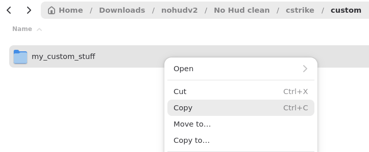
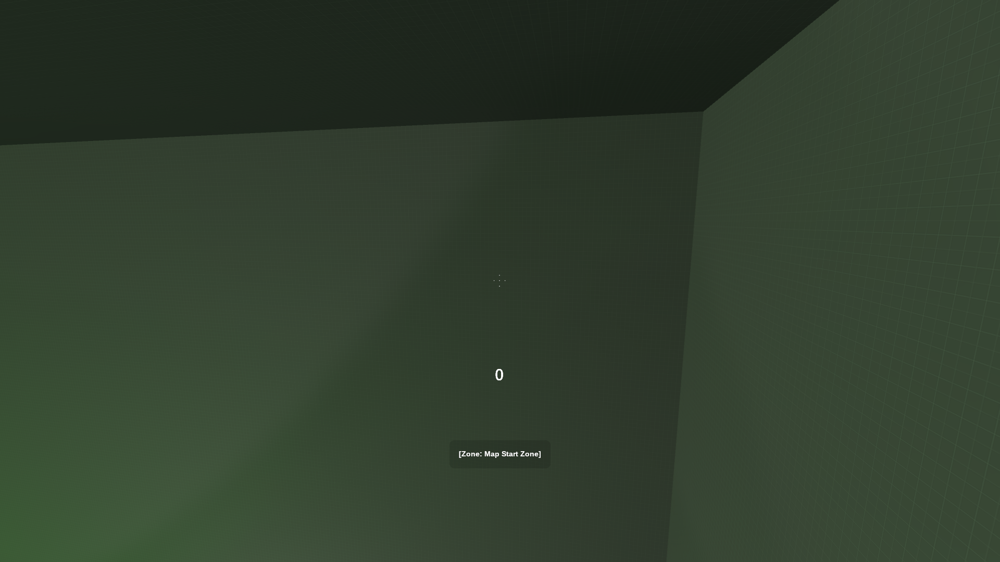

# How to setup Counter Strike: Source for Surfing on Linux
[Keep In Mind](#keep-in-mind)

[Remove the HUD](#remove-the-hud)

[Create Keybinds for KSF Servers](#create-keybinds-for-ksf-servers)

[Download Every KSF Surf Map](#download-every-ksf-surf-map)

[Fix the Missing Textures on Linux](#fix-the-missing-textures-on-linux)

## Keep In Mind
This guide is intended for my own future reference. Here I've compiled my own setup procedures.

I use Fedora Workstation 43 and run CS:S natively.
## Remove the HUD
How to remove HUD elements such as the radar, round timer, and health counter.

HUD removal cannot be done using console commands on public servers, because they require `sv_cheats 1` to be enabled. Instead you need to download a custom HUD.

1. Download No Hud v2 by One from: https://gamebanana.com/mods/15647
2. Extract the .zip file
3. In the extracted folder, navigate into `nohudv2/No\ Hud\ clean/cstrike/custom/`

4. Copy the `my_custom_suff` folder into the CS:S `custom` folder
   - On Linux, this is usually located in `~/.steam/steam/steamapps/common/Counter-Strike\ Source/cstrike/custom/`
   - On Windows, this is usually located in `C:\Program Files (x86)\Steam\steamapps\common\Counter-Strike Source\cstrike\custom`

**Result:** Now every HUD element is hidden, except for the crosshair.
 

> [!NOTE]
> Additional HUD elements may appear as a result of server side plugins. KSF servers may add a speedometer and timer to the HUD.

## Create Keybinds for KSF Servers

On KSF Servers, you can teleport to the start of the map by typing `!r` in the chat. Instead of pressing, `y` → `!` → `r` → `Enter`, we can simply bind `v` to the action. 

Keybinds are created in the developer console using the `bind` function. `bind` can be used by following this template: `bind <key> <command>`

A list of commands can be found here: https://www.ksfclan.com/commands/

### Enable the Developer Console

The developer console is disabled by default. Enable the developer console in the game menu:

1. Launch Counter Strike: Source
2. In the main menu, select the `Options` text
3. In the Options menu, select the `Keyboard` tab
4. In the Keyboard tab, press the `Advanced...` button
5. In the Advanced menu, check the box next to `Enable Developer Console (~)`

**Result:** The developer console is enabled

> [!NOTE]
> The developer console can be launched by pressing the tilde key: the key that produces \` or `~` when modified by the Shift key.

### Personal Keybinds
My personal set ofkeybinds to act as a starting point to begin creating your own set of binds

Copy this line into the console to receive my set of keybinds:

`bind v sm_restart; bind q sm_tele; bind e sm_saveloc; bind x sm_teleprev; bind c sm_telenext; bind z sm_surftimer; bind r sm_pr; bind shift +duck; bind mwheeldown +jump; bind mouse1 +left; bind mouse2 +right`

- v: Restart the map
- q: Teleport to the current location
- e: Save a location
- x: Teleport to the previous location
- c: Teleport to the next location
- z: Open the surf timer menu
- r: Open the personal record menu
- shift: Crouch/Duck
- mousewheel down: Jump (Doesn't override space to jump)
- left click: Turn left
- right click: Turn Right

## Download Every KSF Surf Map
You can download every ksf surf map here: https://github.com/OuiSURF/Surf_Maps

Each map is individually archived with a .rar archive. Instead of extracting every map by hand, you can use the `unrar` command to make it easier:
1. Install unrar: `sudo dnf install unrar`
2. Unzip the Google Dive archives: `unzip '*.zip' -d .`
3. Unrar the : `find . -name "*.rar" -exec unrar x -o+ {} \;` (This may take a while)
4. Run: `rm *.rar`
5. Move the .bsp files into the `maps` directory, usually located in: `~/.steam/steam/steamapps/common/Counter-Strike Source/cstrike/download/maps`

**Result:** Now the majority of surf maps are preinstalled, no longer requiring you to install each map as you join a server.

## Fix the Missing Textures on Linux
Fix the missing texture, the black and purple squares, that appear on linux in some maps. 

Some maps contain missing textures on Linux because they reference assets that are case-insensitive. The fix is outlined here: https://github.com/scorpius2k1/linux-bsp-casefolding-workaround

Here is a shortened procedure for Fedora users:

1. Install dependencies: `sudo dnf makecache && sudo dnf install curl inotify-tools libnotify parallel rsync unzip -y`
2. Clone the repository: `git clone https://github.com/scorpius2k1/linux-bsp-casefolding-workaround.git`
3. Change working directory: `cd linux-bsp-casefolding-workaround`
4. Set permissions: `chmod +x lbspcfw.sh`
5. Run the script: `./lbspcfw.sh`

**Result:** Now a TUI interface will display. Follow the prompts to convert the .bsp files.

> [!NOTE] 
> If the process appears to hang on a map, it is most likely a visual problem. Just wait until the process is finished.
